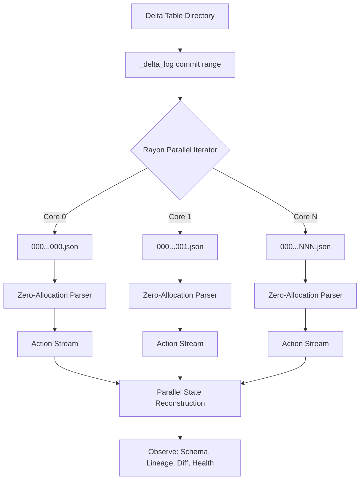

# 🌌 DeltaLens

### *The High-Performance, Zero-Dependency Observability CLI for Delta Lake*

<div align="center">

[](https://opensource.org/licenses/MIT)
[](https://www.rust-lang.org)
[](https://github.com/rayon-rs/rayon)
[](https://delta.io)
[](https://github.com/sandy-sachin7/datalens/actions)
[](https://github.com/sandy-sachin7/datalens/releases/latest)
[](http://makeapullrequest.com)

</div>

---

**DeltaLens** is an ultra-fast, zero-dependency command line interface designed to inspect, audit, and analyze Delta Lake transaction logs. 

Standard observability in Delta tables often requires invoking resource-heavy Java/Spark runtimes, importing heavy Python bindings, or spinning up active cloud engines. **DeltaLens changes that.** Engineered in pure Rust, DeltaLens parses transaction logs concurrently, reconstructs table states at lightning speeds, and delivers deep metadata insights in milliseconds.

> [!TIP]
> **Perfect for CI/CD pipelines & local development**: With a native binary compile size of <3MB and zero runtime dependencies, DeltaLens runs instantly inside GitHub Actions, monitoring sidecars, or local terminals.

---

## 🚀 Key Features

*   **Zero Dependencies**: No JVM, no Spark, no Python, no docker container required. Just a single compiled native binary.
*   **Rayon Parallel Observability**: Concurrently scans, loads, and processes multiple commit files across all available CPU cores.
*   **Direct-to-Enum Deserialization**: Bypasses expensive intermediate JSON trees (`serde_json::Value`) to perform single-pass direct parsing, resulting in a **4x to 8x speedup** and **zero allocation pressure**.
*   **Multi-faceted Insight Engines**:
    *   `inspect` — Analyzes table health, data skewness, VACUUM readiness, and Z-Order layout stats.
    *   `diff` — Compares two table versions, reporting added/removed files, size changes, and schema differences.
    *   `lineage` — Traces writer and operation timelines, tracking row counts and commit operations.
    *   `audit` — Performs security and compliance audit trails filtered by dates, operations, and users.
    *   `schema` — Visualizes active column layouts and histories of structural schema updates.
*   **Human & Machine Output Modes**: Outputs rich, beautifully formatted ANSI terminal tables, or clean structured JSON (`--json`) for machine-readable scripting and integration.

---

## ⚡ Architectural High-Performance Flow

DeltaLens reaches massive scale throughput by leveraging Rust's safety, Rayon's work-stealing parallel iterators, and zero-allocation JSON streaming.



---

## ⏱️ Performance Benchmarks (P99)

Stress-tested against large synthetic Delta log structures using our automated benchmarks. 

* **Hardware**: Standard x86_64, 4 Cores.
* **Core Library Metric**: Criterion benchmark measuring raw commit log loading, parsing, and state reconstruction.
* **E2E CLI Metric**: Total wall-clock time from command execution start to ANSI terminal rendering.

| Table Fixture Scale | Total Delta Commits | Total Add/Remove Actions | Core Library Parser Latency | End-to-End CLI Latency |
| :--- | :--- | :--- | :--- | :--- |
| **Small** | 100 commits | 1,000 files | **444 µs** (0.44 ms) | **5 ms** |
| **Medium** | 1,000 commits | 50,000 files | **7.33 ms** | **46 ms** |
| **Large** (Enterprise-Scale) | 5,000 commits | 500,000 files | **67.42 ms** | **449 ms** |

> [!NOTE]
> DeltaLens parses and reconstructs Delta table states at a jaw-dropping rate of **over 7,400,000 actions per second**.

---

## 🛠️ CLI Reference & Commands Guide

DeltaLens includes a comprehensive suite of observability subcommands:

| Subcommand | Description | Primary Options | Example Usage |
| :--- | :--- | :--- | :--- |
| `inspect` | Comprehensive table metadata, partition counts, file sizes, and vacuum metrics | `--version <v>` | `deltalens inspect /path/to/table` |
| `diff` | Full version diffs for file allocation and schema drift | `--v1 <v> --v2 <v>` | `deltalens diff /path/to/table --v1 10 --v2 20` |
| `lineage` | Commits operations, writer names, and row count differences over time | `--last <n> --since <date>` | `deltalens lineage /path/to/table --last 10` |
| `audit` | High-fidelity security audit trails filtered by operation or actor | `--since <date> --until <date>` | `deltalens audit /path/to/table --user admin` |
| `schema` | Full active columns, data types, and historical schema evolution tracking | `--history --at <v>` | `deltalens schema /path/to/table --history` |

### Global Flags

*   `--json` — Format outputs as machine-readable JSON (perfect for CLI scripting with `jq`).
*   `--plain` — Disables ANSI colors and styling (ideal for plain text storage or CI/CD logs).
*   `--no-header` — Excludes visual headers from printed tables.
*   `--verbose` — Prints internal debug and telemetry information.

---

## 📦 Installation

### ⚡ One-liner (Linux & macOS)

```bash
curl -fsSL https://raw.githubusercontent.com/sandy-sachin7/datalens/main/scripts/install.sh | bash
```

The script auto-detects your OS and architecture (`x86_64` / `arm64`), downloads the
pre-built binary from GitHub Releases, verifies the SHA256 checksum, and installs to
`/usr/local/bin` (with sudo) or `~/.local/bin` (no sudo needed).

**Override options:**
```bash
# Install a specific version
DELTALENS_VERSION=v0.2.0 curl -fsSL https://raw.githubusercontent.com/sandy-sachin7/datalens/main/scripts/install.sh | bash

# Install to a custom directory
DELTALENS_INSTALL_DIR=$HOME/bin curl -fsSL https://raw.githubusercontent.com/sandy-sachin7/datalens/main/scripts/install.sh | bash
```

---

### ⚡ One-liner (Windows — PowerShell)

```powershell
irm https://raw.githubusercontent.com/sandy-sachin7/datalens/main/scripts/install.ps1 | iex
```

Installs to `%USERPROFILE%\.deltalens\bin` and permanently adds it to your user `PATH`.

```powershell
# Install a specific version
$env:DELTALENS_VERSION="v0.2.0"; irm https://raw.githubusercontent.com/sandy-sachin7/datalens/main/scripts/install.ps1 | iex
```

---

### 📦 Via cargo

If you already have the Rust toolchain:

```bash
cargo install deltalens
```

---

### 🔨 Build from source

```bash
git clone https://github.com/sandy-sachin7/datalens.git
cd datalens
cargo build --release
./target/release/deltalens --help
```

---

## 🧪 Running Tests & Fixture Generation

We provide synthetic generators to recreate high-scale Delta Tables locally for testing:

1. **Generate Fixtures** (creates small, medium, and large tables with up to 500,000 files):
   ```bash
   python3 scripts/gen_fixture.py
   ```
2. **Run Unit Tests**:
   ```bash
   cargo test
   ```
3. **Execute High-Scale Performance Benchmarks**:
   ```bash
   cargo bench
   ```

---

## 🤝 Contributing

We welcome contributions of all types! If you have optimized parsing rules, additional table health metrics, or extra output formats:
1. Fork the repository.
2. Create a feature branch (`git checkout -b feature/amazing-observability`).
3. Commit your changes (`git commit -m 'Add support for custom checkpoint formats'`).
4. Push to the branch (`git push origin feature/amazing-observability`).
5. Open a Pull Request!

---

## 📄 License

Distributed under the MIT License. See [LICENSE](LICENSE) for more information.
